# LCARS for Home Assistant

A responsive, full-screen Star Trek LCARS dashboard framework for Home Assistant, built on
[LCARdS](https://github.com/snootched/lcards). You describe your views in one YAML file as a tree of
components (label columns, frames, sections, charts, calendars, controls); the framework builds the
Lovelace configuration, lays it out for every screen from a phone in landscape to a desktop, and sets
up everything Home Assistant needs for it.

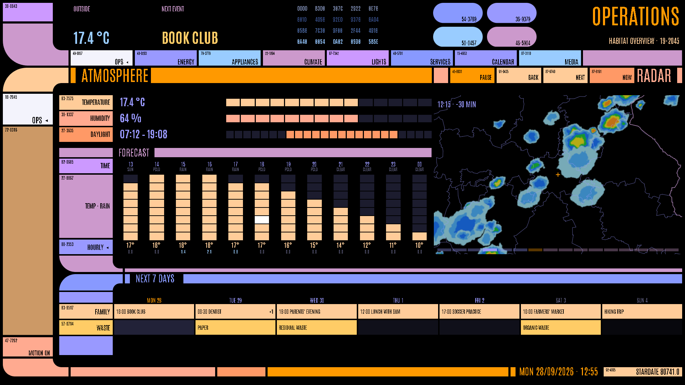

```yaml
sections:
  - key: home
    label: Home
    views:
      - key: home
        label: Home
        bar: [{title: Atmosphere, colour: orange}]
        content:
          type: rows
          rows:
            - {label: Temperature, entity: weather.home, value: {attribute: temperature, unit: "°C"},
               bar: {mode: level, attribute: temperature, min: -10, max: 35}}
            - {label: Daylight, entity: sun.sun, value: {span: [next_rising, next_setting]},
               bar: {mode: span, start: next_rising, end: next_setting}}
```

- **One frame on every page**, the Voyager palette and the Titan.DS-style "database" look: the header
  bar is the section menu, the sidebar lists the section's views, the mid bar carries the content's
  titles and buttons, the foot bar ends in the local date/time and a stardate.
- **Components**: label columns with segment bars, sections, inner frames, frames facing outwards,
  S-shaped chains of frames, matrices that wrap by width, day timelines, week and month calendars, a
  weather forecast, a precipitation radar (Germany), history and mirrored charts, transporter-console
  sliders, schedules, device logs, tanks, a media player and its library, pills. Your own as Python
  plugins.
- **Responsive**: sizes follow the viewport height; content that doesn't fit a shorter screen isn't
  rendered rather than squeezed; phones scroll between the fixed frame bars and see everything.
- **Kiosk-friendly**: dense graphics are light custom cards instead of hundreds of LCARdS buttons, every
  animation has a per-device off switch.
- **Sets itself up**: `lcars setup` installs LCARdS and kiosk-mode through HACS, copies the cards and
  the view theme, registers the resources, creates the helpers and the dashboard; `lcars doctor` checks
  all of it and every entity your views use.

## Screenshots

All from [examples/home.yaml](examples/home.yaml) with made-up data, at 1920×1080 unless noted.

| | |
|-|-|
| [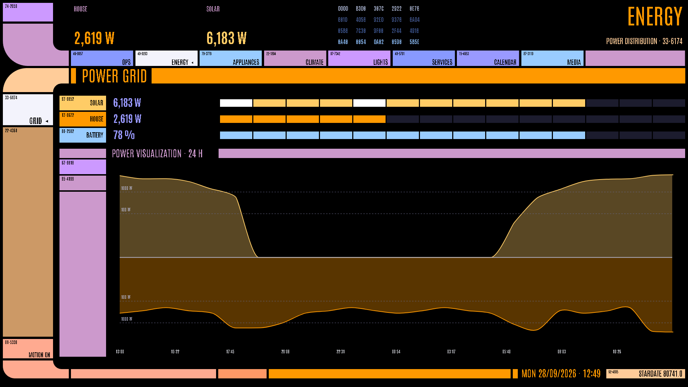](docs/screenshots/energy.png) **Energy**: meters as segment bars, solar and the house mirrored around a zero line | [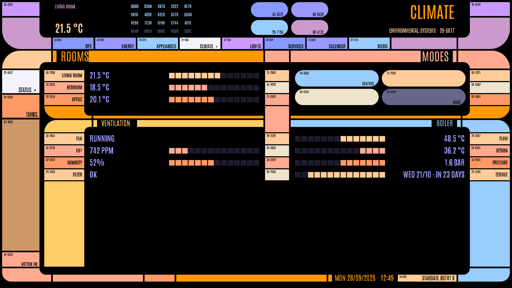](docs/screenshots/climate.png) **Climate**: two label columns, modes as pills, frames facing outwards |
| [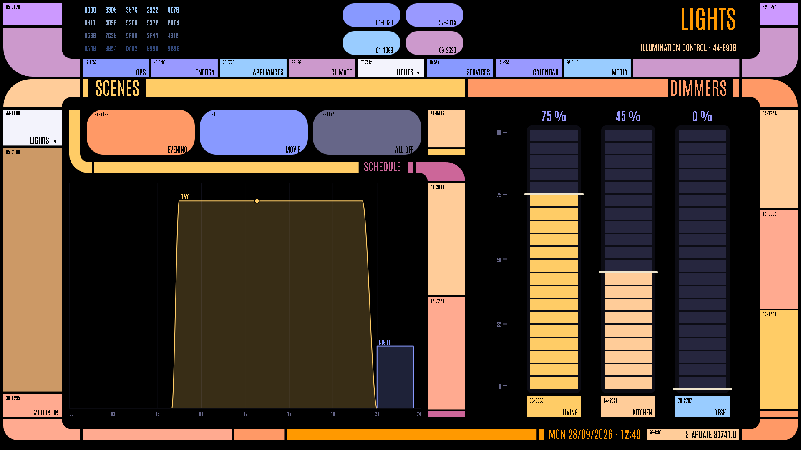](docs/screenshots/lights.png) **Lights**: scenes and a day schedule as an S of frames, transporter-console dimmers | [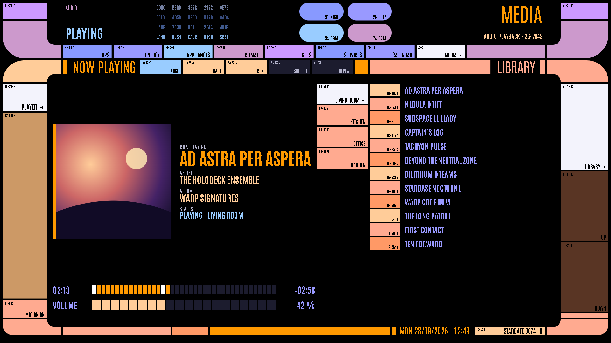](docs/screenshots/media.png) **Media**: now playing, output devices, the library, transport buttons in the mid bar |
| [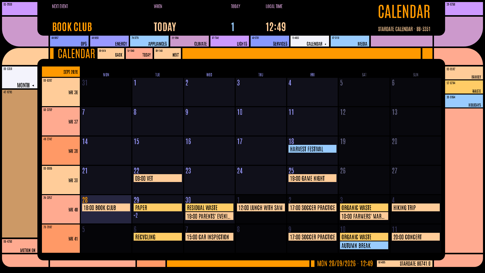](docs/screenshots/calendar.png) **Calendar**: a month of several calendars, next events in the header | [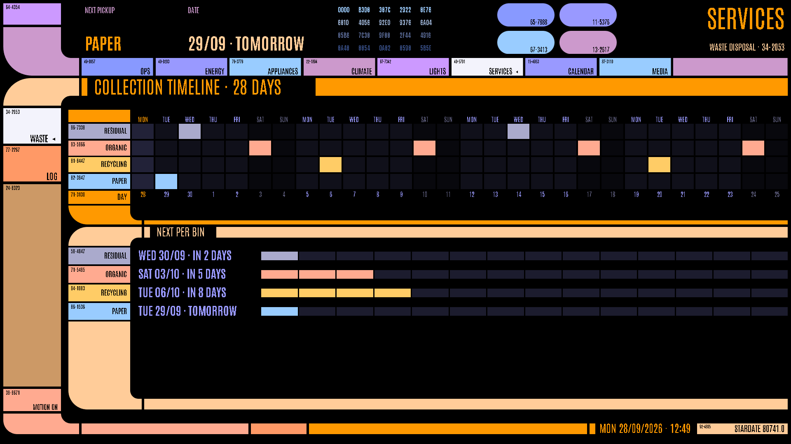](docs/screenshots/waste.png) **Waste**: 28 days of collections on a timeline, countdowns per bin |
| [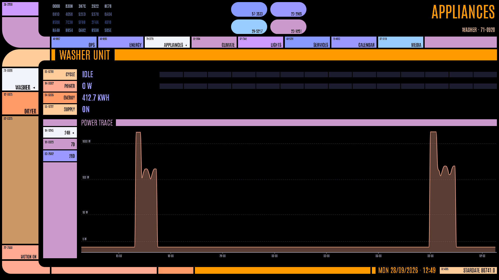](docs/screenshots/appliances.png) **Appliances**: one view per appliance from one `repeat`, a power trace from long-term statistics | [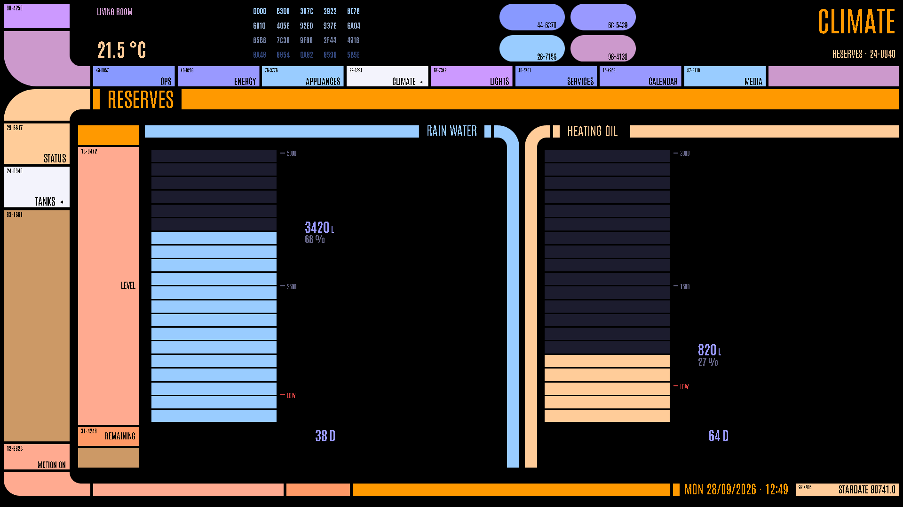](docs/screenshots/tanks.png) **Tanks**: a matrix of frames with fill levels |
| [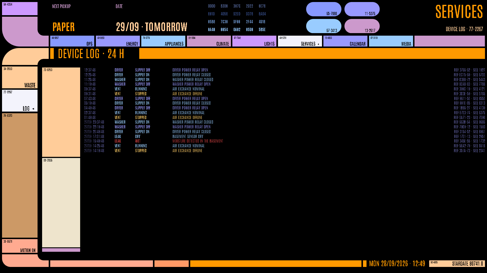](docs/screenshots/log.png) **Device log**: the logbook as an LCARS log, coloured by level | [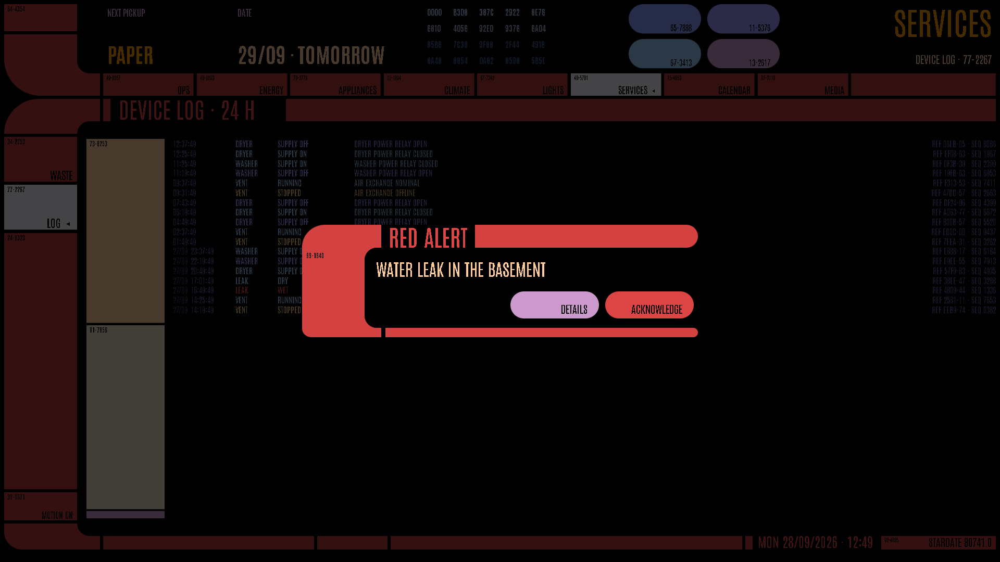](docs/screenshots/alert.png) **Red alert**: a wet leak sensor turns the frame red and asks to be acknowledged |

[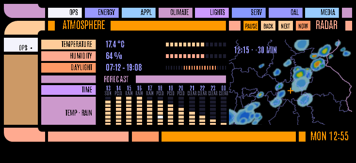](docs/screenshots/phone-ops.png)
**On a phone** (734×337, an iPhone 16 in landscape): the same layout, smaller; the content scrolls between the
fixed frame bars.

## Quick start

```bash
pip install git+https://github.com/d1rty-pixel/lcars-homeassistant   # in a venv, or with pipx
echo "<long-lived token>" > ~/.config/homeassistant/token            # HA: profile → Security
mkdir my-lcars && cd my-lcars
lcars init --url http://homeassistant.local:8123    # a starting lcars.yaml from what your HA has
                                                    # (or copy examples/lcars.example.yaml and edit it)
lcars setup                                         # installs and sets up what the dashboard needs
lcars deploy                                        # builds, validates and saves the dashboard
```

Open `/lcars-bridge/` in Home Assistant. You need HACS in HA and, for `lcars setup` to copy files, SSH
access to HA's configuration (e.g. the Advanced SSH & Web Terminal add-on); without either,
[INSTALL.md](docs/INSTALL.md) lists the steps to do by hand.

## Documentation

| | |
|-|-|
| [INSTALL.md](docs/INSTALL.md) | requirements, what `lcars setup` does, doing it by hand, kiosk tablets, updating, troubleshooting |
| [CONFIGURATION.md](docs/CONFIGURATION.md) | `lcars.yaml`: sections, views, the mid bar, values, colours, sizes, `${{ }}`, `repeat`, build-time data, commands |
| [COMPONENTS.md](docs/COMPONENTS.md) | every component and the responsive behaviour |
| [DESIGN.md](docs/DESIGN.md) | the design rules the frame and the components follow |
| [CARDS.md](docs/CARDS.md) | the light custom cards, also for use by hand |
| [EXTENDING.md](docs/EXTENDING.md) | how it is built, plugins, adding components and cards |
| [OPERATIONS.md](docs/OPERATIONS.md) | checking layouts (screenshots), sounds, known limitations |
| [NOTES.md](docs/NOTES.md) | LCARdS gotchas and their workarounds |
| [integrations/](docs/integrations/) | what the components expect from weather, calendars, waste collection, power meters, media players, the DWD radar |
| [examples/](examples/) | `lcars.example.yaml` (every setting, commented), a minimal configuration, a household using every component, a plugin |

## Repository layout

```
lcars/                  the framework (pip package; the `lcars` command)
  cli.py, config.py,      command, configuration loader and model, the build
  build.py, frame.py      the page frame
  components/             the component types
  engine/                 fluid sizes, screen tiers, palette, LCARS numbers, primitive cards
  setup.py, ha.py, host.py   setup / doctor / init, HA's WebSocket API, file access to HA
  validate.py             the check against LCARdS' JSON schema
  www/                    the light custom cards (JavaScript, no build step)
  themes/                 the view theme "LCARS Bridge"
examples/               example configurations and a plugin
tools/screenshot/       headless screenshots at the target sizes, demo data for the README's
docs/                   the documentation
```

Your own configuration lives wherever you like (its own repository is a good place): `lcars.yaml`,
plugins next to it, and `build/` with the built dashboard and backups.

## Credits

- [LCARdS](https://github.com/snootched/lcards) by snootched: the frame, buttons, elbows, charts and sounds
- [HA-LCARS](https://github.com/th3jesta/ha-lcars) by th3jesta: the LCARS theme for Home Assistant the
  view theme's variables follow
- [kiosk-mode](https://github.com/NemesisRE/kiosk-mode) by NemesisRE
- Radar data and borders: [Deutscher Wetterdienst](https://www.dwd.de) (GeoServer WMS/WFS)
- The layout is inspired by [Titan.DS](https://www.mewho.com/titan/)

## License

[MIT](LICENSE). The license covers this repository's code and docs, not the projects it builds on
(LCARdS, HA-LCARS, kiosk-mode), which have their own licenses, and not DWD's data.

LCARS and Star Trek are trademarks of CBS Studios / Paramount. This is an unofficial fan project with
no affiliation.
